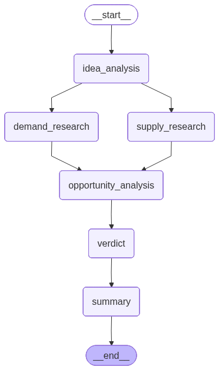

# LaunchLens 🚀

LaunchLens is a LangGraph agent that takes a founder's product idea in plain English and returns a research-backed **Go / No-Go** verdict by fusing demand signals (Google Search/Trends/News via SerpApi) with supply signals (Amazon listings via Oxylabs).

## Graph



`__start__ → idea_analysis → {demand_research, supply_research} → opportunity_analysis → verdict → summary → __end__`

Built in `app/graphs/launchlens_graph.py::build_graph()`, and regenerated as this exact PNG by `app/utils/graph_visualizer.py` via `graph.get_graph().draw_mermaid_png()`.

## Concept Map

Honest status of the five core LangGraph concepts, mapped to file / function / line:

| # | Concept | Where it lives | Status |
|---|---|---|---|
| 1 | **Graph + typed state** | `app/graphs/state.py:3` – `LaunchLensState(TypedDict)`. Wired in `app/graphs/launchlens_graph.py:38-40` (`StateGraph(LaunchLensState)`) and `:72-110` (`START` → ... → `END`) | ✅ Done |
| 2 | **Fan-out (parallel + merge)** | `app/graphs/launchlens_graph.py:77-85` — `idea_analysis` fans out to `demand_research` and `supply_research` in parallel; both merge into `opportunity_analysis` at `:87-95` | ✅ Done |
| 3 | **Routing (conditional edges)** | — | ⚠️ Not yet. The graph is currently a fixed fan-out/merge pipeline; every query walks the same path. No `add_conditional_edges` call exists yet |
| 4 | **Agent node + tools** | `app/agents/chat_agent.py::ChatAgent.run()` wraps NVIDIA's `llama-3.1-nemotron-nano` for every LLM call (`idea_analysis.py:17-18`, `verdict.py:31-32`, and inside `opportunity_analysis.py`). Data sources are called directly as plain Python — `OxylabsService` in `demand_research.py:13-16` and `SerpApiService` in `supply_research.py:15-27` — rather than exposed to the LLM as bound tools it chooses to call | ⚠️ Partial — no real agent↔tool loop yet, just orchestrated LLM calls per node |
| 5 | **Short-term memory** | `app/memory/conversation_memory.py::JsonMemory` — appends turns to `chat_history/conversation.jsonl` (`add_message`, line 17) and returns the last `window * 2` messages (`get_recent`, line 49). Wired into `agent_routes.py:18-20` after each graph run | ⚠️ Partial — persists and windows history, but no LangGraph checkpointer and no summarization node; `summary_node` (`app/graphs/nodes/summary.py:8-10`) just forwards `verdict["report_markdown"]`, it doesn't compress anything |

One naming quirk worth knowing if you're debugging: `demand_research_node` actually pulls **Amazon** listings (Oxylabs — a supply-side source), and `supply_research_node` actually pulls **Google Search/News/Trends** (SerpApi — demand-side sources). The node names are swapped relative to what they fetch.

## Node-by-node

| Node | File | What it does |
|---|---|---|
| `idea_analysis` | `app/graphs/nodes/idea_analysis.py` | LLM call extracts product type, search keywords, and price constraint from the raw query into structured JSON |
| `demand_research` | `app/graphs/nodes/demand_research.py` | `OxylabsService.amazon_search()` → parses refinements + listings (asin, price, rating, reviews) |
| `supply_research` | `app/graphs/nodes/supply_research.py` | `SerpApiService` calls for Google Search, Google News, and Google Trends; each response is parsed down to slim JSON |
| `opportunity_analysis` | `app/graphs/nodes/opportunity_analysis.py` | Pandas-based pass over the Amazon listings (`transformAmazonData`) to compute price bounds and review-weighted volume bias, then an LLM call scores the opportunity |
| `verdict` | `app/graphs/nodes/verdict.py` | LLM call turns the idea + opportunity scorecard into a final verdict JSON, using scoring rules defined in `VERDICT_PROMPT` |
| `summary` | `app/graphs/nodes/summary.py` | Passes `verdict["report_markdown"]` through as `final_report` |

## Tech Stack

- **Language:** Python
- **Orchestration:** LangGraph (`StateGraph`)
- **Backend:** FastAPI (`app/api/main.py`, routes in `app/api/routes/agent_routes.py`)
- **Frontend:** Gradio (`app/ui/gradio_app.py`)
- **LLM:** NVIDIA API, `llama-3.1-nemotron-nano-vl-8b-v1` (Gemini path stubbed but commented out in `chat_agent.py`)
- **Data sources:** SerpApi (Search/News/Trends), Oxylabs (Amazon)
- **Data wrangling:** pandas (in `opportunity_analysis.py`)

## Folder Structure

```
LaunchLens/
├── run.py
├── requirements.txt
├── README.md
├── .env
└── app/
    ├── agents/
    │   └── chat_agent.py
    ├── api/
    │   ├── main.py
    │   └── routes/agent_routes.py
    ├── config/
    │   └── settings.py
    ├── graphs/
    │   ├── launchlens_graph.py
    │   ├── state.py
    │   └── nodes/
    │       ├── idea_analysis.py
    │       ├── demand_research.py
    │       ├── supply_research.py
    │       ├── opportunity_analysis.py
    │       ├── verdict.py
    │       └── summary.py
    ├── memory/
    │   ├── conversation_memory.py
    │   └── chat_history/
    ├── prompts/
    │   ├── idea_prompt.py
    │   ├── opportunity_prompt.py
    │   └── verdict_prompt.py
    ├── services/
    │   ├── oxylabs_service.py
    │   └── serpapi_service.py
    ├── ui/
    │   └── gradio_app.py
    └── utils/
        └── graph_visualizer.py
```

## Installation

```bash
git clone https://github.com/rajivprao/LaunchLens.git
cd LaunchLens
python -m venv venv
```

Activate it:

```bash
# Windows
venv\Scripts\activate

# macOS / Linux
source venv/bin/activate
```

```bash
pip install -r requirements.txt
```

## Configuration

Create a `.env` file in the project root:

```env
NVIDIA_API_KEY=<key>
SERP_API_KEY=<key>
OXYLABS_API_UN=<username>
OXYLABS_API_PW=<password>
```

`Secrets` (`app/config/settings.py`) loads these via `python-dotenv`. Note `GEMINI_API_KEY` is read from an env var named `GEMINI_KEY`, not `GEMINI_API_KEY` — that's how it's wired in `settings.py:14`, and it's unused since the Gemini client is commented out in `chat_agent.py`.

## How to Run

```bash
python run.py
```

`run.py` starts FastAPI first, waits 3 seconds, then launches Gradio:

- **API (FastAPI):** `http://localhost:8000` — POST to `/chat` with `{"query": "..."}`
- **UI (Gradio):** `http://localhost:7890`

## Demo Prompts

Try these against the Gradio UI or the `/chat` endpoint:

1. "I want to launch a stainless-steel insulated water bottle in India under ₹1,500 — is it worth it?"
2. "Validate a subscription box for artisanal coffee beans, budget ₹800/month."
3. "Is there room for a new ergonomic laptop stand under ₹2,000?"

Each of these should walk the full graph: idea extraction → parallel Amazon + Google research → opportunity scoring → verdict → final report.

## Roadmap

- [ ] Add a routing node so intent (demand-only / pricing-only / full report) actually changes the path taken
- [ ] Replace direct service calls with LangChain tool bindings so the agent chooses which source to call
- [ ] Add a LangGraph checkpointer for durable state across restarts
- [ ] Add real summarization/compaction once conversations get long, rather than passthrough
